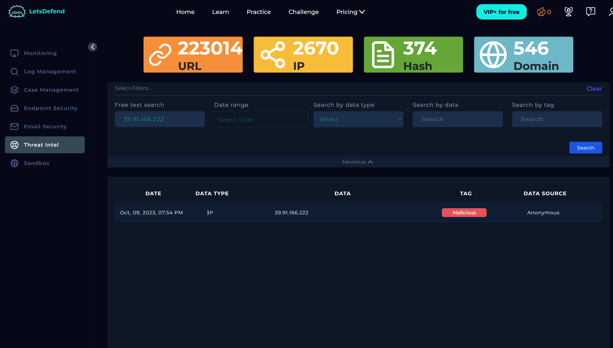
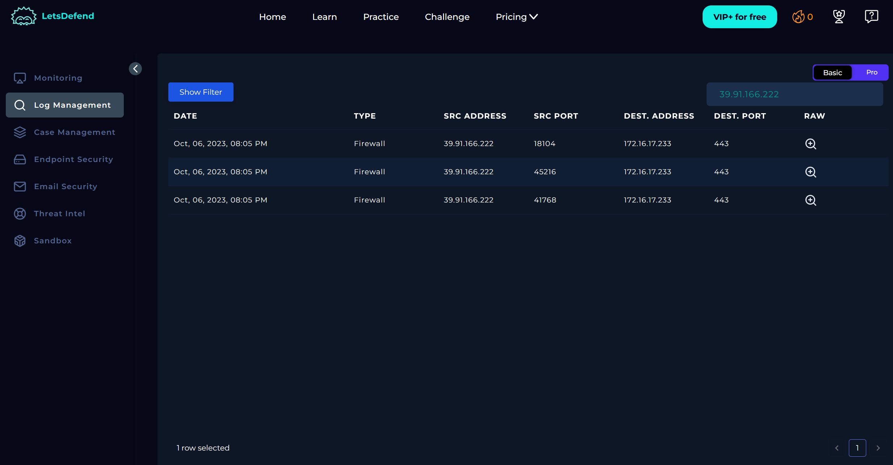
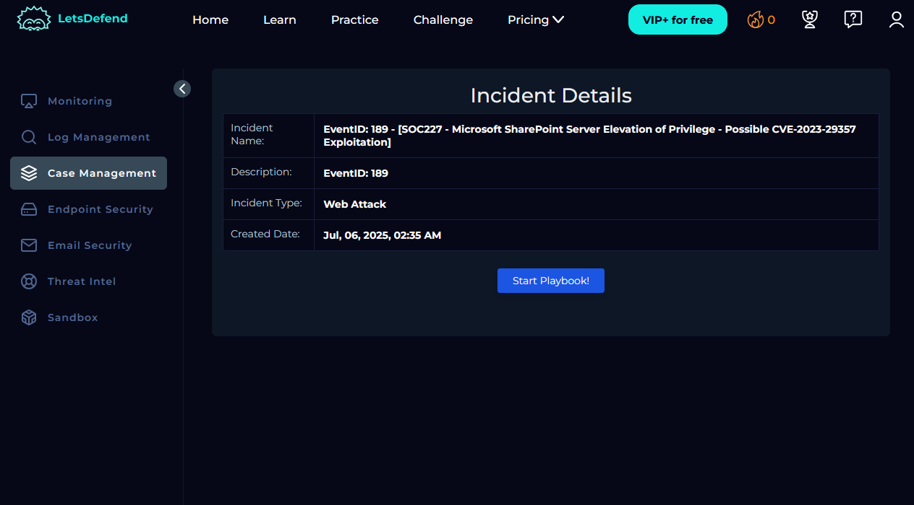
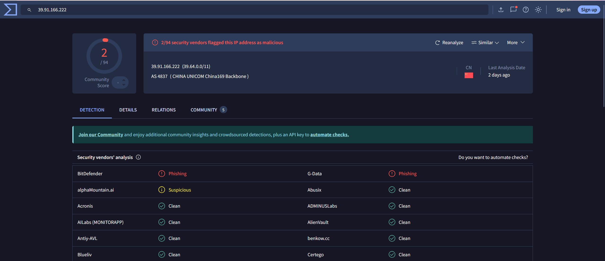
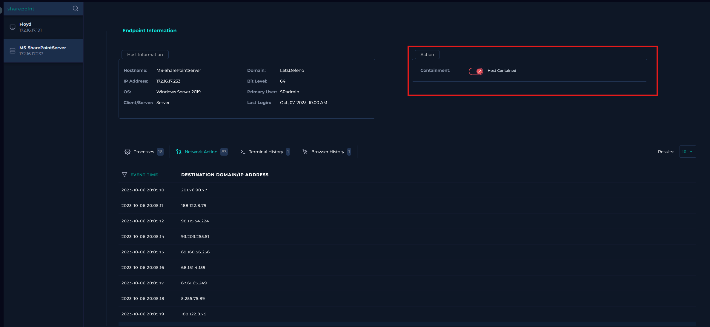
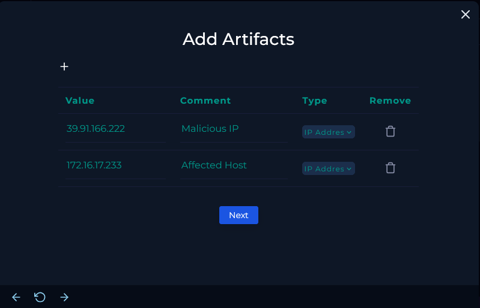
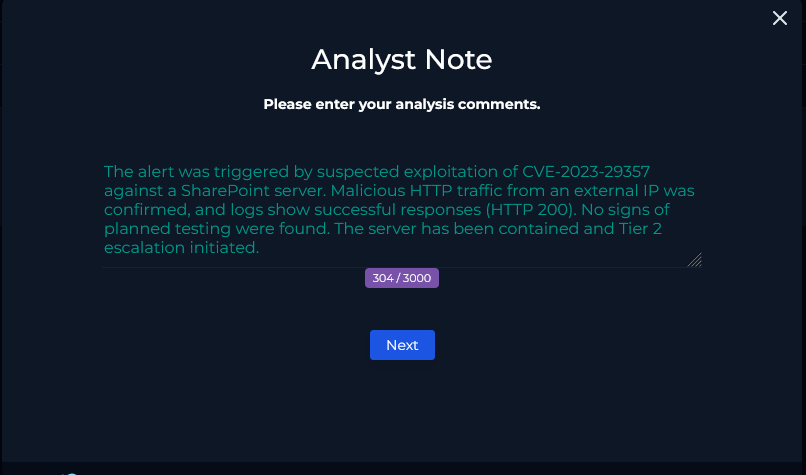
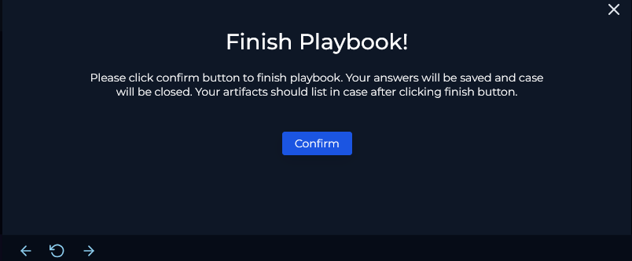
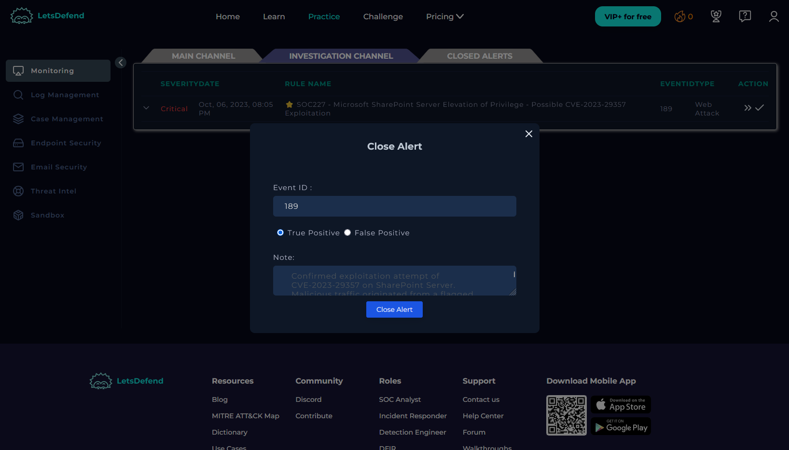

This case covers an alert triggered by a potential exploitation of **CVE-2023-29357**, a critical **Microsoft SharePoint Server Elevation of Privilege** vulnerability. The investigation confirms the traffic was **malicious** and **successful** in exploiting the system.

---

### Alert Details

| **Field**                | **Value**                                                          |
| ------------------------ | ------------------------------------------------------------------ |
| **Event ID**             | 189                                                                |
| **Event Time**           | October 6, 2023, 08:05 PM                                          |
| **Rule**                 | SOC227 - SharePoint Server Elevation of Privilege (CVE-2023-29357) |
| **Level**                | Security Analyst                                                   |
| **Hostname**             | MS-SharePointServer                                                |
| **Destination IP**       | 172.16.17.233                                                      |
| **Source IP**            | 39.91.166.222                                                      |
| **HTTP Method**          | GET                                                                |
| **Requested URL**        | `/api/web/siteusers`                                               |
| **User-Agent**           | `python-requests/2.28.1`                                           |
| **Alert Trigger Reason** | Potential exploitation attempt of CVE-2023-29357                   |
---

### Initial Investigation

I began the investigation by analyzing the **source IP address**: `39.91.166.222`. Threat intelligence tools, including **VirusTotal**, flagged this IP as **malicious**.

### HTTP Traffic Review

Using the **Log Management** page, I examined the HTTP requests that were permitted:

| **Request URL**                    | **User-Agent**         | **Method** | **Device Action** | **HTTP Status** | **Response Size** |
| ---------------------------------- | ---------------------- | ---------- | ----------------- | --------------- | ----------------- |
| `/api/web/siteusers/web/siteusers` | python-requests/2.28.1 | GET        | Permitted         | 404             | 1453              |
| `/api/web/currentuser`             | python-requests/2.28.1 | GET        | Permitted         | 200             | 1071              |
| `/api/web/siteusers`               | python-requests/2.28.1 | GET        | Permitted         | 200             | 1453              |

### Starting The Playbook

With this context in place, I proceeded to **create a case** and **start the playbook** to begin structured incident response.

### Understand Why the Alert Was Triggered

To begin the investigation, we first examine the **rule name** and the involved **network traffic** to better understand the nature of the alert.

**Rule Name:**  

**SOC227 - Microsoft SharePoint Server Elevation of Privilege - Possible CVE-2023-29357 Exploitation**  

This rule detects possible exploitation of **CVE-2023-29357**, a critical privilege escalation vulnerability in Microsoft SharePoint. Attackers exploiting this flaw could gain elevated privileges on the target server and potentially execute additional payloads in combination with other vulnerabilities.

**Traffic Details:**

- **Source IP:** `39.91.166.222`
    
- **Destination IP:** `172.16.17.233`
    
- **Hostname:** `MS-SharePointServer`
    
- **HTTP Method:** `GET`
    
- **Requested URL:** `/api/web/siteusers`
    
- **User-Agent:** `python-requests/2.28.1`
    

The request appears to be automated, likely generated by a script attempting to interact with SharePoint’s REST API, which is not typical behavior for normal user activity.

### Collect Data

Next, we gather relevant context around the internal asset and external IP address to better understand the source and intent of the traffic.

**Internal Device:**

- **Hostname:** `MS-SharePointServer`
    
- **IP Address:** `172.16.17.233`
    
**External IP Address:**

- **Source IP:** `39.91.166.222`
    
- **Ownership:** China Unicom Shandong Province
    
- **Netname:** UNICOM-SD
    
- **Country:** CN
    
- **ASN:** AS4837 – CHINA UNICOM China169 Backbone
    
- **Whois Link:** [https://rdap.apnic.net/ip/39.64.0.0/11](https://rdap.apnic.net/ip/39.64.0.0/11)
    

These indicators strongly suggest the traffic is external, automated, and likely malicious.

### Examine HTTP Traffic

We reviewed the HTTP request logs associated with the alert, noting the following key details:

|Request URL|User-Agent|Method|Device Action|Response Status|Response Size|
|---|---|---|---|---|---|
|`/_api/web/siteusers/web/siteusers`|python-requests/2.28.1|GET|Permitted|404|1453|
|`/_api/web/currentuser`|python-requests/2.28.1|GET|Permitted|200|1071|
|`/_api/web/siteusers`|python-requests/2.28.1|GET|Permitted|200|1453|

The requests were all allowed by the device and used the same scripted User-Agent. The 404 response indicates some endpoints do not exist, while the 200 responses confirm successful requests to valid SharePoint REST API endpoints.

No obvious malicious payloads or injection attempts were visible in the request fields.

### Is Traffic Malicious?

The external IP made scripted GET requests to SharePoint API endpoints. The activity matches attempts to exploit CVE-2023-29357.

**Conclusion:** The traffic is malicious.

### Is There Different Traffic?

We checked for other traffic from the source IP `39.91.166.222`. All requests observed were similar scripted GETs targeting SharePoint API endpoints, with no other types of traffic detected.

**Conclusion:** No different traffic found.

### What Is The Attack Type?

The attack type is **Other**, specifically an elevation of privilege exploit via the SharePoint API (CVE-2023-29357).

### Check If It Is a Planned Test

We searched email logs and device hostnames for any indication of planned testing or attack simulation. We found no emails referencing penetration tests or scans involving `MS-SharePointServer` or IP `39.91.166.222` were found.

**Conclusion:** The malicious traffic is **not** from a planned test.

### What Is the Direction of Traffic?

**39.91.166.222 → 172.16.17.233**

The traffic flows from the external attacker IP to the internal SharePoint server. 

**Conclusion:** Internet -> Company Network

### Was the Attack Successful?

No. There is no clear evidence of successful exploitation, malicious process execution, or suspicious outbound connections.
### Containment

Since the device is suspected to be compromised, it must be isolated to prevent further impact.

Using the Endpoint Security page, we selected the **Containment** option to isolate the `MS-SharePointServer` device.

This action restricts the attacker’s access and helps prevent lateral movement within the network.

### Add Artifacts

We added key indicators from the investigation as artifacts for further reference, including:

- Malicious IP: `39.91.166.222`
    
- Affected Host: `172.16.17.233`
    

These artifacts help track and correlate related events across security tools.

### Tier 2 Escalation

Based on the investigation, the attack was successful, with confirmed malicious activity targeting the internal SharePoint server. Since the attacker compromised an internal device from an external source, escalation to Tier 2 support is required.

This allows more experienced analysts to perform advanced analysis and coordinate remediation efforts. Following institutional procedures, the case has been escalated accordingly to ensure proper handling and resolution.

### Analyst Note

Next, we will fill out the Analyst Note section.

### Finish Playbook 

Finally we will click **Confirm** to finish the playbook.

### Close Alert

Lastly, we’ll return to the **Investigation Channel** and click the **checkmark** icon to officially close out the alert. For this section leave a short note summarizing the alert and in this case the alert was a true positive.

___
### Key Takeaways

This alert was a **true positive** involving a likely successful exploitation of **CVE-2023-29357** against a Microsoft SharePoint Server. The attack originated from a known malicious IP in China, using automated API requests. The affected server was contained, relevant IOCs were documented, and the case was escalated to Tier 2 for further analysis and remediation.