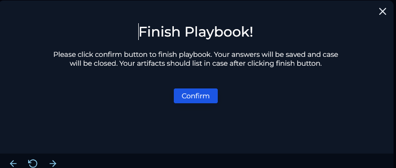

<article>

## Getting Started

To begin investigating this alert, we will take ownership and review the event data below.

---

### Event Data

|Field|Value|
|---|---|
|EventID|263|
|Event Time|Jun 06, 2024, 03:12 PM|
|Rule|SOC287 - Arbitrary File Read on Checkpoint Security Gateway [CVE-2024-24919]|
|Level|Security Analyst|
|Hostname|CP-Spark-Gateway-01|
|Destination IP Address|172.16.20.146|
|Source IP Address|203.160.68.12|
|HTTP Request Method|POST|
|Requested URL|172.16.20.146/clients/MyCRL|
|Request|aCSHELL/../../../../../../../../../../etc/passwd|
|User-Agent|Mozilla/5.0 (Macintosh; Intel Mac OS X 10.15; rv:126.0) Gecko/20100101 Firefox/126.0|
|Alert Trigger Reason|Characteristics exploit pattern detected on Request, indicative exploitation of CVE-2024-24919|
|Device Action|Allowed|

---

### Initial Observations

From the event details, it’s immediately apparent that this is a **directory traversal** attempt aimed at reading the `/etc/passwd` file, a classic technique used for user enumeration or privilege escalation.

This attack typically targets vulnerable web services that improperly handle file paths, especially when user input is not sanitized correctly. Next, we’ll review CVE-2024-24919 to better understand the vulnerability.

### About CVE-2024-24919

CVE-2024-24919 is a **critical arbitrary file read vulnerability** impacting **Checkpoint Security Gateway appliances**. It enables unauthenticated remote attackers to access sensitive files on the system such as `/etc/passwd`, SSH keys, and configuration files.

The flaw stems from improper input validation in a web component. Specifically, a crafted HTTP POST request to the `clients/MyCRL` endpoint can exploit directory traversal sequences (`../../../../../`) to access arbitrary files.

### Key Details:

- **CVE ID:** CVE-2024-24919
    
- **CVSS Score:** 8.6 (High)
    
- **Attack Vector:** Remote, unauthenticated
    
- **Affected Products:** Check Point Security Gateway and Quantum Spark appliances
    
- **Attack Type:** Arbitrary File Read via Directory Traversal
    
- **Public Exploits:** Yes
    
- **Patch Available:** Yes – vendor hotfixes released May 28, 2024
    

---

### Investigation

Before starting the playbook, I reviewed the logs on the management page to gather more context about the affected endpoint. Below are key logs explained:

This shows a classic directory traversal attempt targeting `/etc/passwd`. The payload’s structure (`../../..`) matches the known CVE-2024-24919 exploit pattern.

This subsequent attempt targeted `/etc/shadow` — a more sensitive file containing hashed passwords. This request was **denied**, likely due to system or WAF restrictions.

Following the successful `/etc/passwd` read, the attacker sent a `POST` to the root path `/` with no payload, likely probing server behavior or scanning for other vulnerabilities.

Initial `GET` requests appear to be reconnaissance steps. The successful read of `/etc/passwd` is confirmed by response codes, while the attempt to read `/etc/shadow` was blocked.

Checking the source IP’s reputation on VirusTotal revealed multiple reports of malicious activity:

This confirms the IP as suspicious and malicious. With this data, we are ready to create a case and proceed with the playbook.

---

### Create A Case And Start Playbook

Navigate to the **Monitoring** tab, then **Investigation Channel** to locate this event. Click the arrow and select **Continue** to create a case.

Next, you’ll see the playbook initiation screen:

---

### Playbook Requirements

### Understand Why the Alert Was Triggered

Before analyzing, understand why the alert fired to assess if it’s a true or false positive.

- **Examine the rule name:** It indicates the attack type the rule detects.
    
- **Identify the communicating devices:** Knowing traffic direction, involved devices, and protocol gives insight into the event’s context.
    

### Collect Data

Gather key data points:

- **IP and device ownership**
    
- **For external traffic:**
    
    - IP ownership (static/dynamic, hosting provider)
        
    - IP reputation (check VirusTotal, AbuseIPDB, Cisco Talos)
        
- **For internal traffic:**
    
    - Device hostname
        
    - User owning the device
        
    - Last user logon time
        

### Examine HTTP Traffic

Inspect all parts of the HTTP request (URL, headers, cookies, body) for malicious payloads like SQL Injection, XSS, Command Injection, IDOR, RFI/LFI.

- Attackers often hide payloads beyond just the URL.
    
- Refer to Web Attacks 101 for common attack patterns and detection methods.
    

---

### Is Traffic Malicious?

Based on investigation, this traffic is **malicious**.

The attack vector is **Local File Inclusion (LFI)** via directory traversal (`../../../../`), allowing access to sensitive server files such as `/etc/passwd` and `/etc/shadow`.

No indications that this was a planned test or false positive per the Email Security tab.

---

### What Is The Direction Of Traffic?

The malicious traffic flows from:

- **Source:** 203.160.68.12 (external attacker)
    
- **Destination:** 172.16.20.146 (internal Checkpoint Security Gateway)
    

**Direction:** 203.160.68.12 → 172.16.20.146

So, the correct choice is **Internet → Company Network**.

---

### Check Whether the Attack Was Successful

To determine success:

- **Command Injection:** Check command history for unauthorized commands.
    
- **SQL Injection:** Look for evidence of executed system commands.
    
- **HTTP Response Size:** In SQL Injection and IDOR, large or abnormal response sizes can indicate success.
    

The `/etc/passwd` request from IP 203.160.68.12 returned **200 OK**, confirming the attack successfully read sensitive data via LFI so we will choose "Yes" here.

---

### Containment

To contain the affected device:

- Go to **Endpoint Security**.
    
- Search for the endpoint.
    
- Flip the "Containment" switch.
    

---

### Add Artifacts

Below are the artifacts I added for this case:

---

### Escalation

Since the attack was successful, Tier 2 escalation is required so we will choose "Yes". Next we can add in our Analyst Note.

---

### Finish Playbook

Click **Confirm** to complete the playbook.

Then, close the alert from the Investigation Channel:

Before closing, add a brief note and mark the alert as a **True Positive** since this was a genuine exploit. And that's it by now you should have completed all the requirements for this event.

___

## Closing Notes

This investigation confirmed a successful exploitation of the CVE-2024-24919 vulnerability on the Checkpoint Security Gateway, allowing an unauthenticated attacker to read sensitive system files via directory traversal. Timely detection and containment prevented further compromise, highlighting the importance of vigilant monitoring and swift response. Applying vendor patches and continuously monitoring for such indicators will help maintain the security posture against similar threats.

</article>
