

<article>

## Introduction

This writeup details my solutions and approaches to some of my favorite challenges from the Correlation One DoD Cyber Sentinel Challenge. The full challenge set covered multiple domains including web security, forensics, OSINT, networking, and reconnaissance. Each task was tackled with clear objectives, systematic analysis, and appropriate tooling to identify vulnerabilities, decode hidden information, and extract flags. This experience provided practical exposure to real-world cybersecurity scenarios, strengthening skills in exploitation techniques, protocol analysis, and investigative research relevant to defense operations. Although this writeup highlights select challenges, many more were part of the full competition.

## Web Security

### Field Reports Mayhem – 150 pts 

We've gained access to the Juche Jaguar's Field Reports archive through an operative's use of weak credentials. Upon logging in, the operative sees their previous field reports and can file new ones. Somewhere in here, I am sure some 'leet' agent stashed the Supreme Leader's secret pizza discount code!

Log in to the portal at: [http://35.245.106.190/login.html](http://35.245.106.190/login.html)  
Use the credentials: `1234:spudpotato`

**Objective:**  
Access the system with provided creds and find the secret pizza discount code hidden in the field reports.

**Approach:**

1. Logged in using the provided credentials: `1234:spudpotato`  
    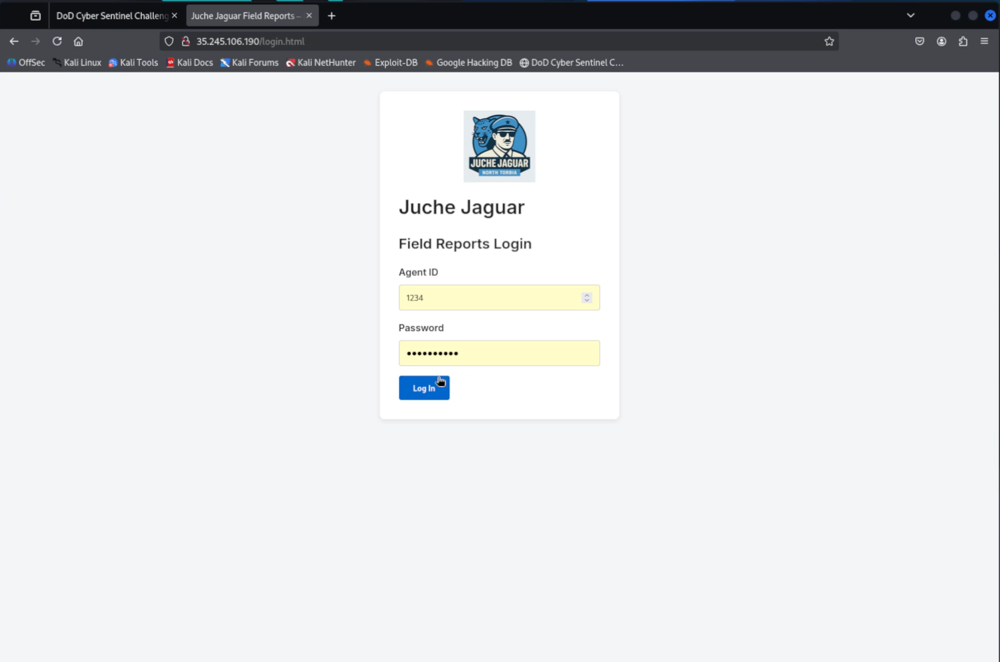
    
2. Noticed the application allowed access to other agents’ reports without restriction — a classic **IDOR vulnerability**.  
    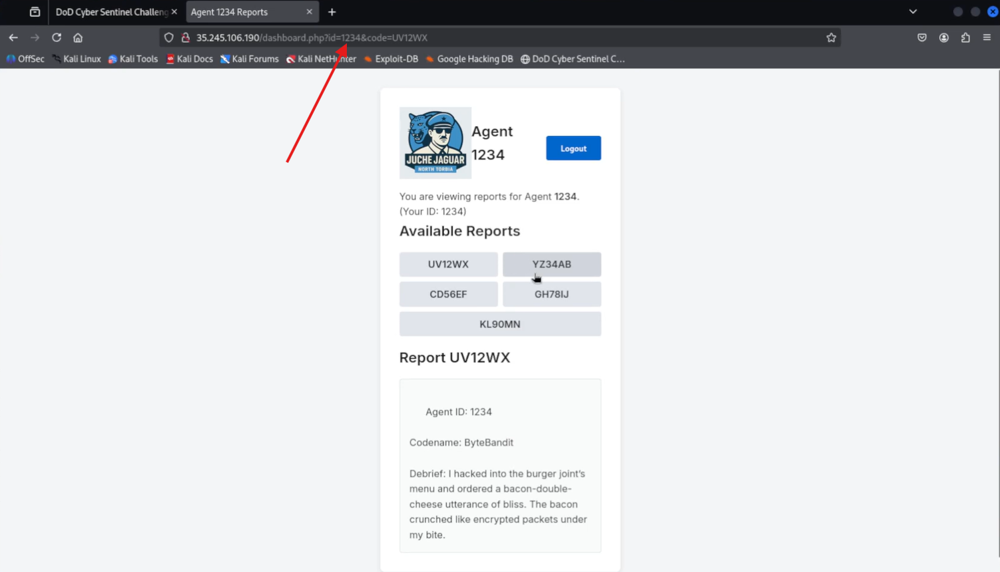
    
3. Manually browsed reports for agents `1233` to `1236`, inspecting all report IDs — no flag found, but food-themed jokes and metaphors were prevalent.  
    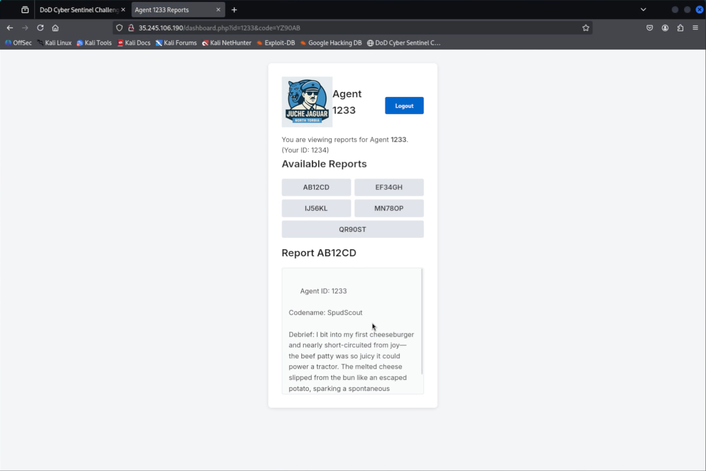
    
4. Re-read the challenge and noticed the word **“leet”**, which translates to `1337`.
    
5. Changed the agent ID in the URL or request to `1337` → Unlocked access to **Agent 1337’s report**, which contained the **flag**.  
    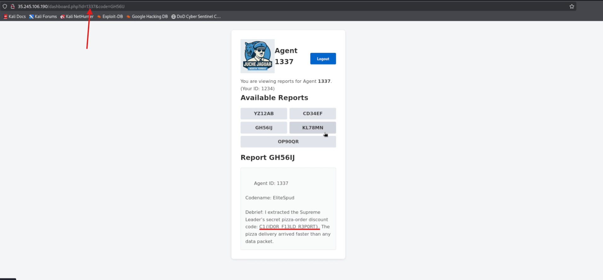
    

**Vulnerability:**  
Insecure Direct Object Reference (IDOR) with a hint hidden in the challenge description.

**Takeaway:**  
This challenge combined technical enumeration with creative interpretation of textual clues — a strong reminder to always consider both the tech and the context.

---

### None Shall Pass – 200 pts 

Deep inside Juche Jaguar's intranet runs a custom token-based gateway protecting their most sensitive files at `/secret`. We got our hands on a low-privilege account (user:pass = `agent:spudpotato`) — use it to request an access token, then find a way to trick the gateway into granting you full admin rights and pull down the hidden intelligence (the flag) from `/secret`. Good luck, Operative.

[http://34.85.163.182:8080/login.html](http://34.85.163.182:8080/login.html)

**Objective:**  
Authenticate, obtain a token, escalate privileges, and access the `/secret` endpoint to retrieve the flag.

**Approach:**

1. Logged in using credentials `agent:spudpotato` → received a token after authentication.  
    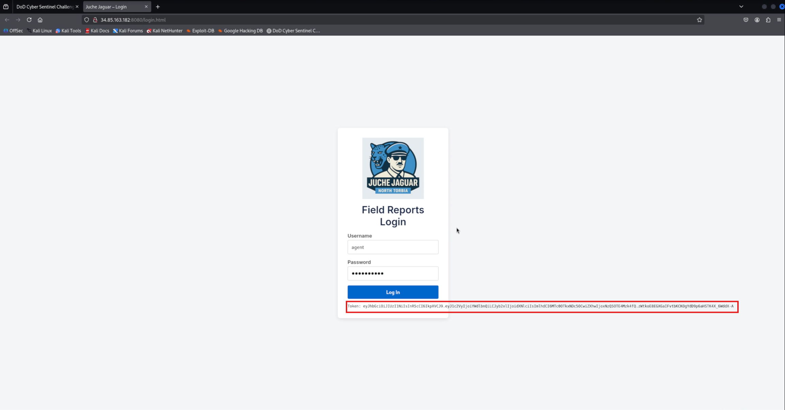
    
2. Examined the token, which appeared to be Base64URL encoded and structured like a JSON Web Token (JWT).
    
3. Decoded the token’s payload, revealing fields such as `"user": "agent"` and `"role": "user"`.  
    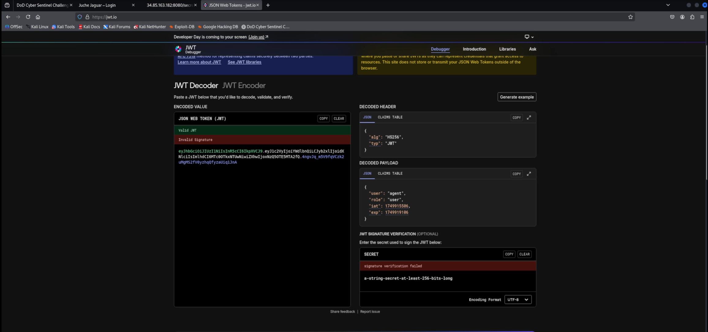
    
4. Modified the `"role"` field in the token payload from `"user"` to `"admin"`.
    
5. Re-encoded the modified payload and replaced the original token with this forged token in subsequent requests.
    
6. The server accepted the forged token without proper signature verification, granting admin-level access.
    
7. Accessed the `/secret` endpoint successfully and retrieved the flag.  
    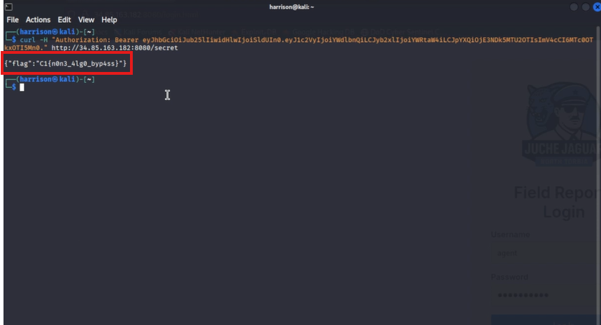
    

**Vulnerability:**  
The server failed to properly validate the token’s integrity, allowing privilege escalation by tampering with the token payload. The token was either not cryptographically signed or signature verification was bypassed.

**Takeaway:**  
A great example of why tokens must always be cryptographically signed and validated. Simply base64-encoding a JSON object is not secure.

---

## Forensics

### Listening Post – 150 pts 

We've intercepted a radio broadcast being bounced off a satellite likely intended for the North Torbian cells located around the world. Do you think you can unravel what they are transmitting?

The two attached files are the same audio, just provided in two different formats.

**Objective:**  
Decode the hidden message encoded as DTMF tones within an audio file (`radio.wav`).

**Approach:**

1. Viewed file in Audacity — it did not seem to play anything audible and looked sort of like Morse code.  
    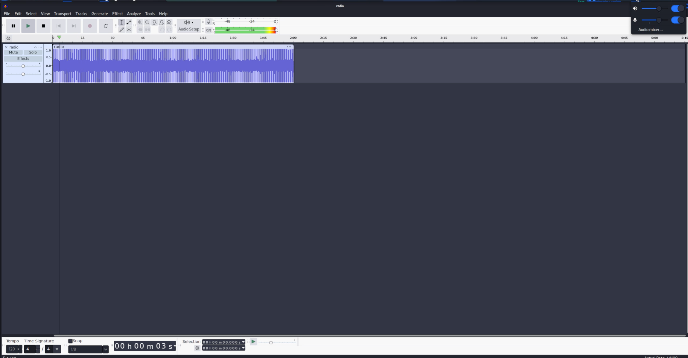
    
2. Ran `multimon-ng` to decode DTMF tones from the WAV audio:  
    `multimon-ng -t raw -a DTMF radio.raw > dtmf_output.txt`  
    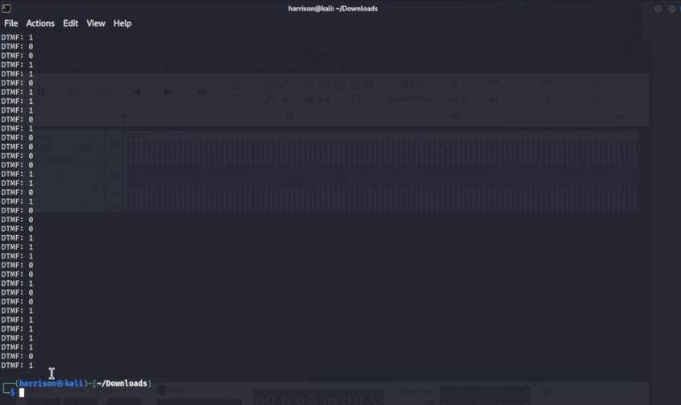
    
3. Extracted the sequence of DTMF digits (binary 0s and 1s) from the output file:  
    `grep "DTMF:" dtmf_output.txt | awk '{print $2}' | tr -d '\n' > binary_string.txt`
    
4. Converted the binary string to ASCII text:  
    `perl -lpe '$_=pack("B*",$_)' < binary_string.txt`
    
5. The result was the decoded plaintext message hidden inside the audio file.  
    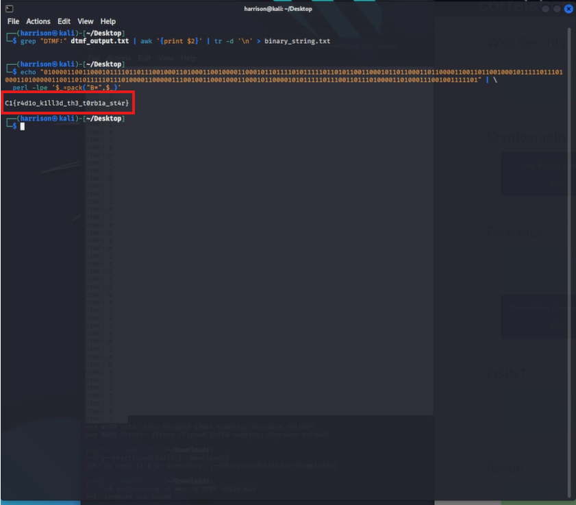
    

**Tools Used:**

- multimon-ng for DTMF decoding
    
- grep and awk for data extraction
    
- perl for binary-to-text conversion
    

**Takeaway:**  
DTMF tones can be used as a covert channel to encode binary data in audio files. Decoding requires specialized tools and binary-to-text conversion.

---

## OSINT

### Problems in North TORbia – 150 pts 

We were given a ransom note but none of our files were encrypted. Regardless, could you run it back and see what information could be gleaned from it?

**Objective:**  
Analyze the ransom note and discover hidden information.

**Approach:**

This challenge gave us a ransom note and asked us to find more info from the note.  
After reading the note, I found a website where the ransom could be paid.  
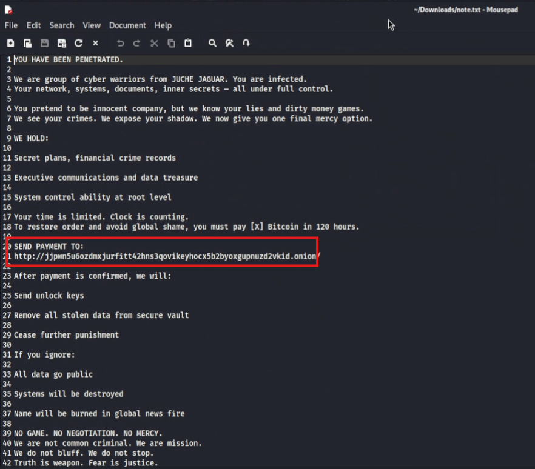

The website was a `.onion` so I knew I had to install Tor Browser and get connected to the Tor network.

After visiting the site `http://jjpwn5u6ozdmxjurfitt42hns3qovikeyhocx5b2byoxgupnuzd2vkid.onion/`, we were greeted with a message on screen.  
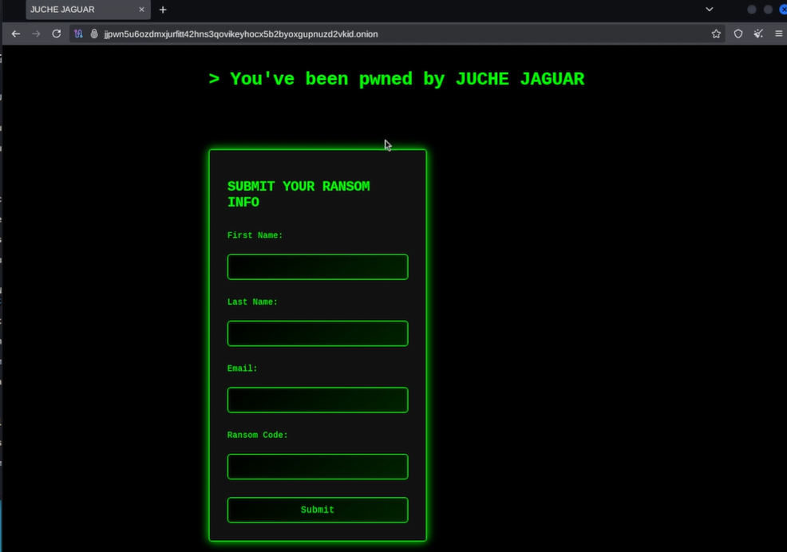

I filled out the form a few times with random details but nothing happened.

When I inspected the page source, that’s when I found the flag hidden in the HTML.  
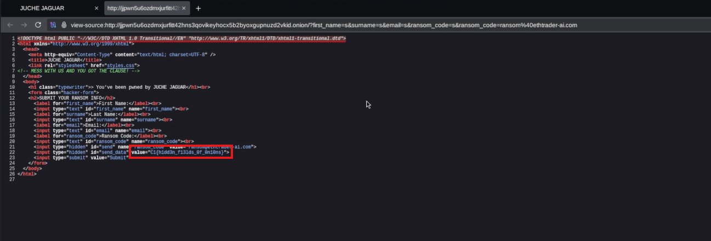

**Takeaway:**  
Sometimes, hidden information can be revealed by inspecting source code even when no visible interaction occurs.

---

### Inspo. – 200 pts 

We believe that the North Torbians are heavily influenced by North Korean developments and wish to match them. We have suspicions that Juche Jaguar will try to build out similar spaces to ones in these pictures. Can you find the coordinates of where these pictures were taken?

The flag is any valid decimal degree coordinate notation within a 500m radius of the building. The flag is in the following format:  
`C1{xX.xxx, xx.xxx}`  
Example: The White House → `C1{38.897, -77.036}`

**Objective:**  
Identify the GPS coordinates of the buildings shown in the photos.

**Approach:**

This flag was pretty straightforward. I just had to take both images, use Google reverse image search on them, and find the approximate location of where they were taken.

I checked for metadata with `exiftool`, but both photos lacked location data, so that’s why I used Google reverse image search.

**Takeaway:**  
When metadata is missing, image reverse search is a powerful tool for geolocation OSINT.

---

## Networking

### Packet Whisperer – 75 pts 

Our blue team intercepted a network capture file. It contains unencrypted HTTP traffic. While skimming through it, analysts believe someone accidentally exposed their login credentials in plain text. Review the PCAP to find the password that the user logged in with.

**Objective:**  
Extract the password exposed in the unencrypted HTTP traffic.

**Approach:**

I was very quickly able to find the flag for this challenge by using Wireshark and looking for insecure protocols such as HTTP login requests. The packet shows the plaintext password that is also the flag for this challenge.  
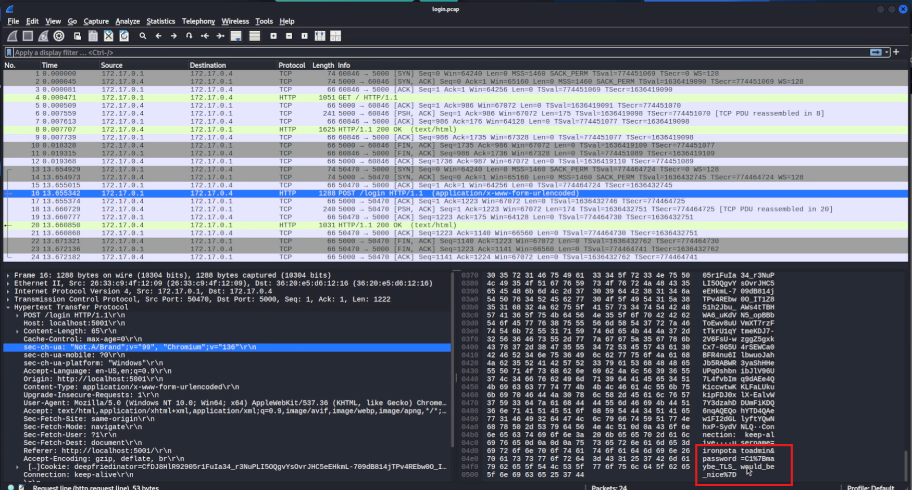

**Takeaway:**  
Cleartext network protocols expose sensitive information easily; always use encryption.

---

## Recon

### Hoasted Toasted – 150 pts 

We have discovered what we believe is a North Torbian public website and have suspicions there is a secret internal-only site hidden there as well. Figure out how to connect to the hidden site and find the flag!

The site is at `https://not-torbian.ethtrader-ai.com/`

**Objective:**  
Discover and access a hidden internal site hosted behind the public-facing North Torbian website.

**Approach:**

1. Identified the public-facing domain as: `not-torbian.ethtrader-ai.com`
    
2. Queried the SSL certificate for the server using OpenSSL to enumerate alternate domains:  
    `echo | openssl s_client -connect not-torbian.ethtrader-ai.com:443 -servername not-torbian.ethtrader-ai.com 2>/dev/null | openssl x509 -noout -text | grep -A 10 "Subject Alternative Name"`
    
3. Found an alternate internal-only domain listed in the certificate:  
    `DNS:definitelynotaflag.north.torbia`  
    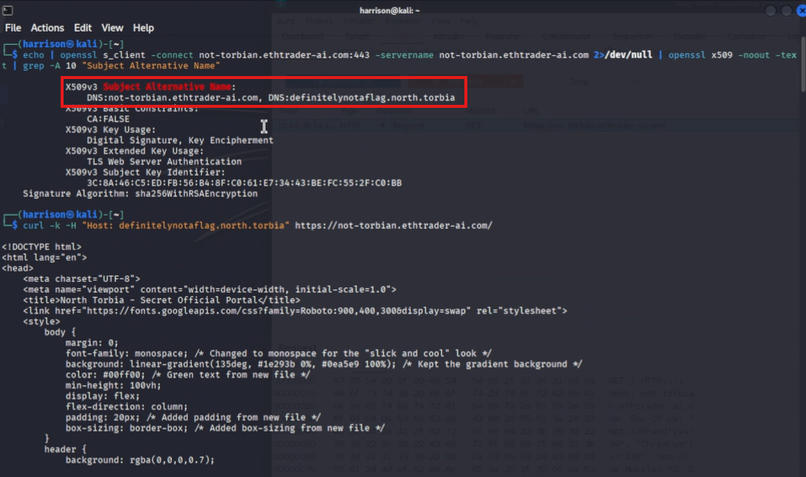
    
4. Sent a request to the original IP/host but spoofed the Host header to access the hidden site:  
    `curl -k -H "Host: definitelynotaflag.north.torbia" https://not-torbian.ethtrader-ai.com/`
    
5. This revealed a hidden web portal titled “North Torbia - Secret Official Portal” and displayed the flag.  
    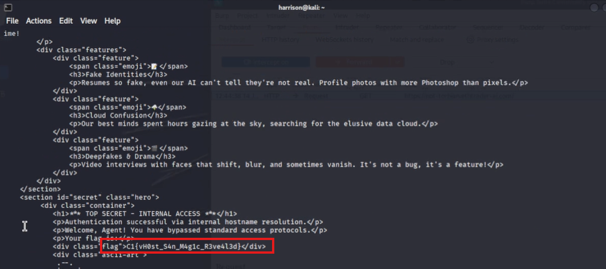
    

**Tools Used:**

- openssl for certificate inspection
    
- curl for crafting a custom Host header request
    

**Takeaway:**  
Inspecting SSL certificates can expose alternate domain names intended for internal use. In environments where name-based virtual hosting is used, accessing these hidden domains is possible by setting a custom Host header — a common CTF and red team tactic.

---

### Screamin' Streamin' – 200 pts 

We've received intel that Juche Jaguar has exposed a network stream on the host `34.85.185.78` between TCP ports 5000 and 10000. Once you find the port, connect to the correct stream name and report back with a flag.

**Objective:**  
Identify the open streaming port and connect to the correct RTSP stream path to capture the flag.

**Approach:**

1. Scanned for open TCP ports in the target range using nmap:  
    `nmap -p 5000-10000 34.85.185.78`  
    Found that port 8774 was open.  
    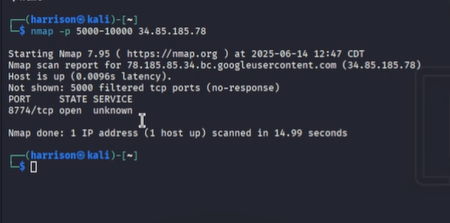
    
2. Attempted to connect to the stream using ffplay:  
    `ffplay rtsp://34.85.185.78:8774/`  
    This failed to load the stream.  
    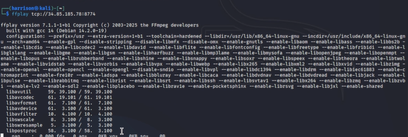
    
3. Probed the RTSP service manually with telnet to understand available options:  
    `telnet 34.85.185.78 8774`  
    Sent an OPTIONS request:
    Response confirmed RTSP functionality:  
    `RTSP/1.0 200 OK`  
    `Public: DESCRIBE, ANNOUNCE, SETUP, PLAY, RECORD, TEARDOWN`
    
4. Tried various DESCRIBE paths but received 404 Not Found and 400 Bad Request.  
    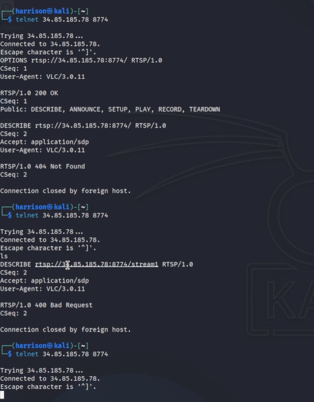
    
5. Successfully connected using the correct stream path and transport protocol:  
    `ffplay -rtsp_transport tcp rtsp://34.85.185.78:8774/stream`  
    The stream played and revealed the flag.  
    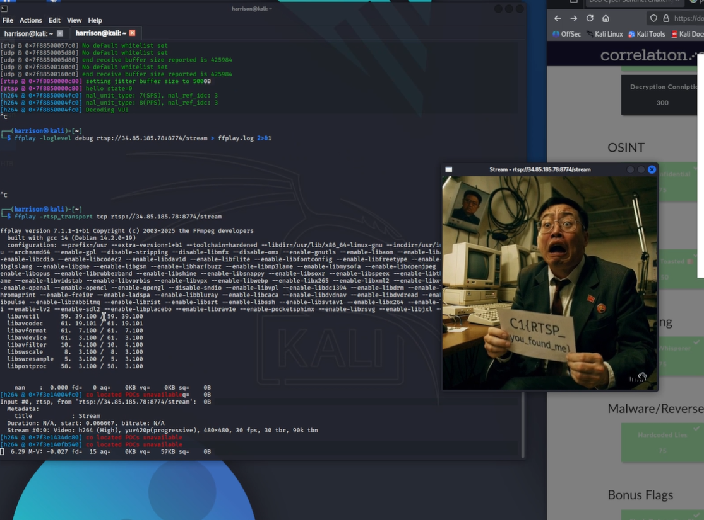
    

**Tools Used:**

- nmap for port scanning
    
- telnet for manual RTSP interaction
    
- ffplay for connecting and viewing the RTSP stream
    

**Takeaway:**  
When dealing with exposed RTSP services, it’s crucial to enumerate both open ports and potential stream paths. Manual RTSP probing can provide protocol-level insight, and using the right transport (TCP vs UDP) is often key to successful playback.

---

## Conclusion

Completing the Correlation One DoD Cyber Sentinel Challenge underscored the critical importance of combining technical knowledge with creative problem solving and careful analysis. The variety of challenges from token manipulation and covert communication decoding to network enumeration and domain reconnaissance reinforced a holistic approach to cybersecurity. This writeup captures the key techniques and lessons learned from my favorite challenges, serving as a valuable resource for future exercises and professional growth within the cybersecurity and defense sectors.

</article>
