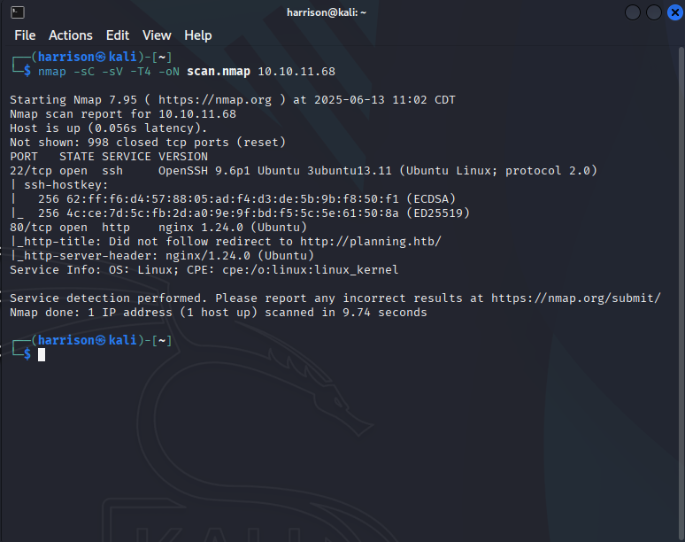
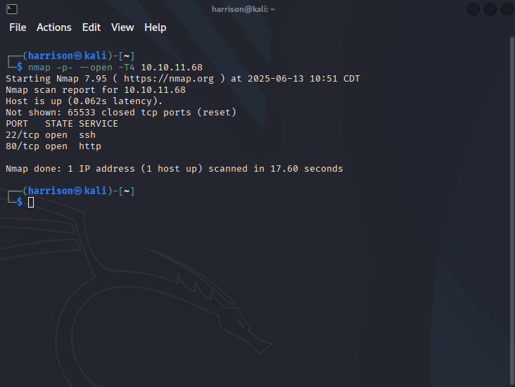
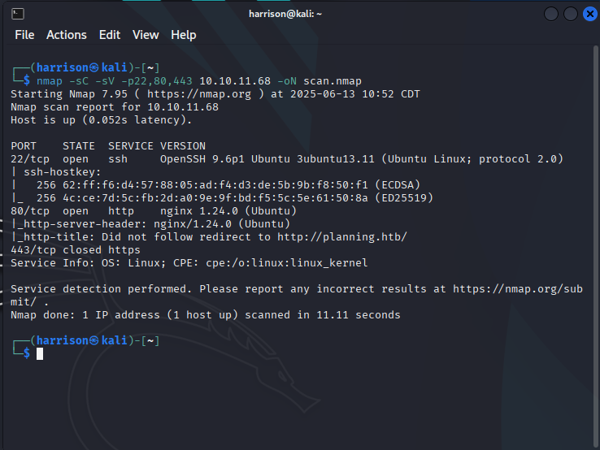

<style>
  article img {
    max-width: 100%;
    width: auto;
    height: auto;
    border-radius: 12px;
    box-shadow: var(--box-shadow);
    margin: 1em auto;
    display: block;
  }
</style>

<article>

When I start working on a box or assessing a network, **Nmap is almost always the first thing I reach for**. It's fast, flexible, and gives me a clear initial view of what I’m up against.

### What is Nmap?
**Nmap** is a free, open-source tool used to discover hosts and services on a network. It works by sending packets and analyzing the responses. It’s powerful for everything from simple pings to OS detection and vulnerability scanning.

### How to install Nmap

Nmap is very easy to install. Use the following command or link to install it on your system. Most Linux distros come with it pre-installed, but if not, use the command below. For Windows, you will need to download and install Nmap from the link below.

**Linux:**

```bash
sudo apt update && sudo apt install nmap
```

Windows: https://nmap.org/download#windows

___

## My Go To Nmap Scans

When I scan a box, I typically start with a simple scan that runs the default scripts, checks for service versions, and saves the results to a readable file for future reference. I also use the option `-T4` to speed up the scan a bit. The default scan timing is `-T3`, so this allows us to scan faster without increasing our risk of detection much.

```bash
nmap -sC -sV -T4 -oN scan.nmap <Target IP>
```

- `-sC`: Runs default scripts (like checking for HTTP titles, SSH banners, etc.)
    
- `-sV`: Tries to detect service versions
    
- `-T4`: Speeds up the scan a bit
    
- `-oN initial.nmap`: Saves the output to a readable file named scan.nmap
    
- `<Target IP>`: Replace this with the HTB box IP



For this example I used a box named "Planning" on hack the box and as we can see the output of this scan is giving us a lot of good information to work with. We now know that the machine has an open website and SSH. It also gives us the versions that each service is running.
### Full TCP Port Scan

I run the full TCP port scan when I feel like I may be missing something from the scan above. This helps assure me that there's no service left behind during initial enumeration. This scan can take significantly longer than the first one, so be patient.

```bash
nmap -p- --open -T4 <Target IP>
```


This checks all 65535 TCP ports and helps catch services running on non-standard ports.




As expected the TCP scan did not give us much info to work with as its sort of a higher level scan. From the results of this scan we know that port 22 and port 80 are open but we dont get any version information.
### Service & Version Detection

This scan is very important as it gives more detailed information on the versions of services running on specified ports. For this example, I’ve chosen common ports such as SSH, HTTP, and HTTPS. Once you know the versions, you can research potential vulnerabilities for those services.

```bash
nmap -sC -sV -p22,80,443 <Target IP> -oN scan.nmap
```

- `-sC`: Default scripts
    
- `-sV`: Version detection
    
- `-P`: Specified ports
    
- `-oN`: Save results in normal output format to scan.nmap



As you can see from the output above, this scan reveals service banners and version details, which are crucial for identifying possible vulnerabilities or misconfigurations. It's a lighter, more targeted version of the full scan and is great when you're short on time or just want to confirm what's running on specific ports.

### Subnet Scan

This is an additional scan that can be useful if you need to scan an entire subnet. It’s not common with HTB, since they provide a specific target IP, but if you want to scan your own home network, you can use the following command. Just make sure to adjust the IP range to match your network’s addressing scheme. This scan identifies all active hosts on the subnet, allowing you to perform deeper scans on individual hosts using the commands mentioned earlier.

```bash
nmap -sP 192.168.1.0/24
```

___
## Common Nmap Options

Below are some additional scan options that can be used with Nmap. You can combine these to build more advanced and tailored scans based on your needs.
### Basic Scans

- `-sS` – TCP SYN scan (default, stealthy)
    
- `-sT` – TCP Connect scan (non-root users)
    
- `-sU` – UDP scan
    
- `-sn` – Ping scan (host discovery only)
    
- `-p-` – Scan all 65,535 ports
    
- `-F` – Fast scan (top 100 ports)
    

### Service & Version Detection

- `-sV` – Detect service versions
    
- `-sC` – Run default scripts
    
- `--script=<name>` – Run specific NSE scripts
    

### Extra Discovery

- `-O` – OS detection
    
- `-A` – Aggressive scan (`-sC -sV -O --traceroute`)
    
- `-Pn` – Skip ping (assume host is up)
    

### Timing & Output

- `-T4` – Faster scan speed (default is T3)
    
- `--open` – Show only open ports
    
- `-oN <file>` – Normal output
    
- `-oA <name>` – Output all formats (N, G, X)

___

Nmap is an essential tool in any cybersecurity toolkit. It provides a fast and reliable way to discover hosts, open ports, and services giving you a solid foundation for further exploration or penetration testing. Whether you’re working on HTB labs, assessing your home network, or performing professional security assessments, mastering Nmap will significantly improve your efficiency and effectiveness.

The examples in this post cover simple and commonly used scan types, but Nmap can get far more complex and powerful depending on your goals. Its scripting engine, scan tuning, and detection capabilities make it incredibly versatile.

Start simple, then gradually explore its advanced features and scripting capabilities. Remember, enumeration is key to understanding your target before moving deeper.

Happy scanning!  

Want to explore more Nmap scan types? Check out the [official documentation](https://nmap.org/book/man.html).
<article>